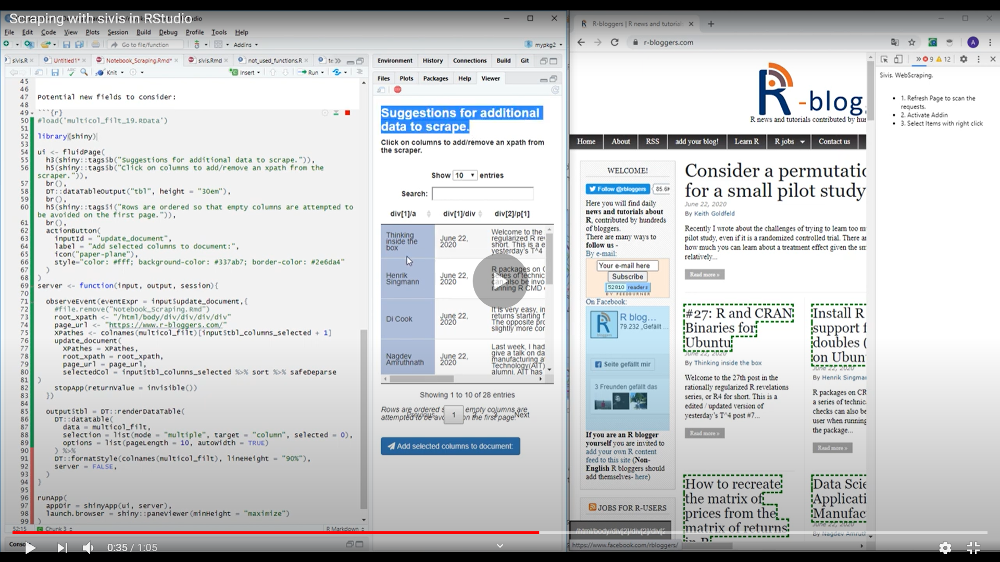

# Sivis: Turning browser clicks into reproducible scraping code.

A framework for creating and monitoring scrapers efficiently in R(Studio).

## Example video:

## Installation
`devtools::install_github('Toniiiio/sivis')`

Run `sivis::chrome_addin_tutorial()` for instructions to add the chrome addin.

## Dependencies
Chrome

